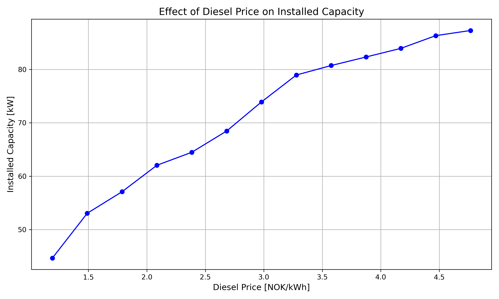

# Energy System Optimization for Svalbard (AE-341, UNIS)

An energy system optimization model for Isfjord Radio, a remote Arctic research station on Svalbard (78°N), built with [PyPSA](https://pypsa.org/). The model determines the cost-optimal mix of renewable generation, energy storage, and backup diesel capacity to meet both electricity and heating demand under CO2 emission constraints. Developed as a course project for AE-341 at the University Centre in Svalbard (UNIS), based on the [PyPSA-Longyearbyen](https://hdl.handle.net/10037/22287) model by Koen van Greevenbroek and Lars Klein.

## Model Overview

The energy system model covers the full electricity and heat supply chain at Isfjord Radio. The station experiences extreme seasonal variation in solar irradiance — polar night from October to February and midnight sun from April to August — making wind power and long-duration storage critical for reliable year-round supply.

**Generation:**
- Wind turbines: SWP (standard) and IceWind (ice-resistant, designed for Arctic icing conditions)
- Solar PV: rooftop (98 kWp existing) and ground-mounted park (200 kWp existing)
- Diesel GenSets: combined heat and power with waste heat recovery

**Storage:**
- Lithium-ion batteries (405 kWh existing) for short-term electricity buffering
- Hydrogen storage (electrolysis + fuel cell) for seasonal/long-duration storage
- Hot water thermal storage (235 kWh existing) for heat buffering

**Heat supply:**
- Diesel GenSet waste heat recovery
- Fuel cell waste heat recovery
- Electric boiler (128 kW existing)
- Geothermal heat pump (COP ~4)

**Constraints:**
- Global CO2 emission limit on diesel consumption
- Existing infrastructure capacities are fixed; the optimizer can add new capacity



## Installation

```bash
# Clone the repository
git clone https://github.com/Kai3421/svalbard-energy-model.git
cd svalbard-energy-model

# Create a virtual environment and install dependencies
python -m venv venv
source venv/bin/activate  # On Windows: venv\Scripts\activate
pip install -r requirements.txt
```

The model uses Gurobi as the default solver. For academic licenses, see [Gurobi Academic Program](https://www.gurobi.com/academia/academic-program-and-licenses/). Alternatively, configure an open-source solver (HiGHS, CBC, or GLPK) in `config.yml`.

## Usage

### Run the optimization model

```python
from src.model import run_model

# Optimize with 50 tonnes CO2 limit and 0.2 EUR/kWh diesel price
n = run_model(co2_limit=50, diesel_price=0.2)

# Inspect optimal capacities
print(n.generators.p_nom_opt)
print(n.stores.e_nom_opt)
```

### Run from the command line

```bash
python -m src.model
```

### Analysis notebooks

The `notebooks/` directory contains Jupyter notebooks for sensitivity analysis and results visualization. Run them from the project root:

```bash
jupyter notebook notebooks/
```

## Key Results

The model explores the trade-off between diesel costs, CO2 emissions, and renewable investment. Key findings include:

- Wind power (especially IceWind turbines) dominates the optimal generation mix due to year-round availability
- Hydrogen storage provides essential seasonal buffering to bridge the polar night
- Solar PV contributes during the midnight sun period but requires complementary storage
- Higher diesel prices and stricter CO2 limits drive increased renewable + storage investment

See `notebooks/cost_emission_sensitivity.ipynb` and `notebooks/diesel_sensitivity.ipynb` for detailed sensitivity analyses.

## Repository Structure

```
svalbard-energy-model/
├── src/                    # Core model code
│   ├── model.py            # Network definition, components, optimization
│   └── utilities.py        # Cost calculation and parameter loading
├── data/                   # Input data
│   ├── parameters.csv      # Technology costs and efficiencies
│   ├── isfjord_load.csv    # Hourly electricity and heat demand
│   ├── isfjord_solar.csv   # Hourly solar PV capacity factors
│   ├── isfjord_wind.csv    # Hourly wind capacity factors
│   └── data_isfjord.nc     # Station measurement data (netCDF)
├── notebooks/              # Analysis and visualization
│   ├── lcoe_analysis.ipynb
│   ├── cost_emission_sensitivity.ipynb
│   ├── diesel_sensitivity.ipynb
│   └── ...
├── figures/                # Generated plots
├── results/                # Solved model outputs (.nc, gitignored)
├── config.yml              # Model configuration
├── requirements.txt        # Python dependencies
└── LICENSE                 # GPL-3.0
```

## License

This project is licensed under the [GPL-3.0](LICENSE).
